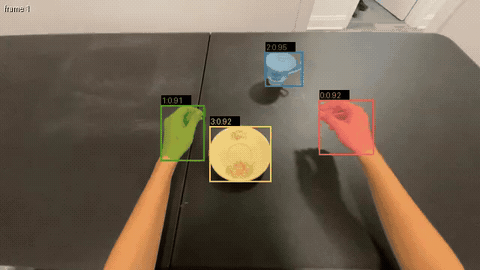
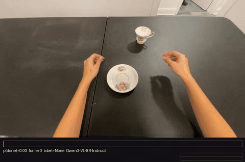
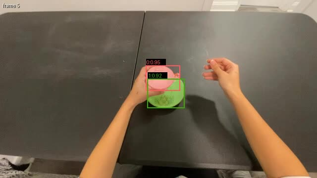
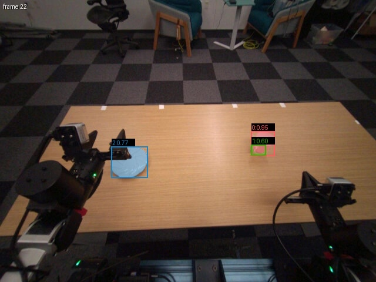
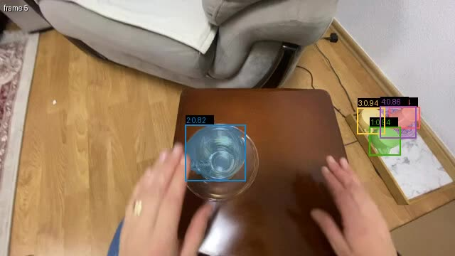
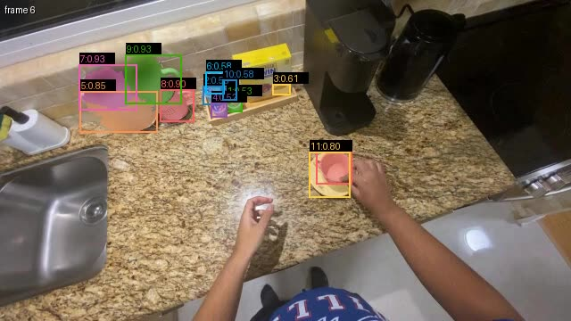
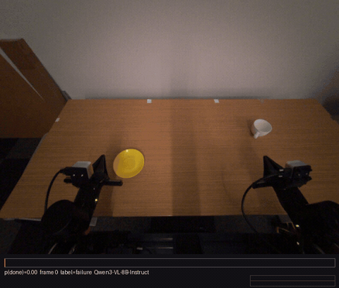
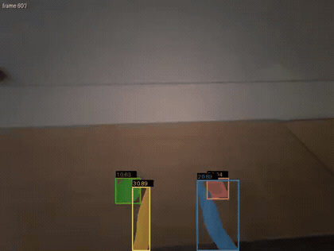
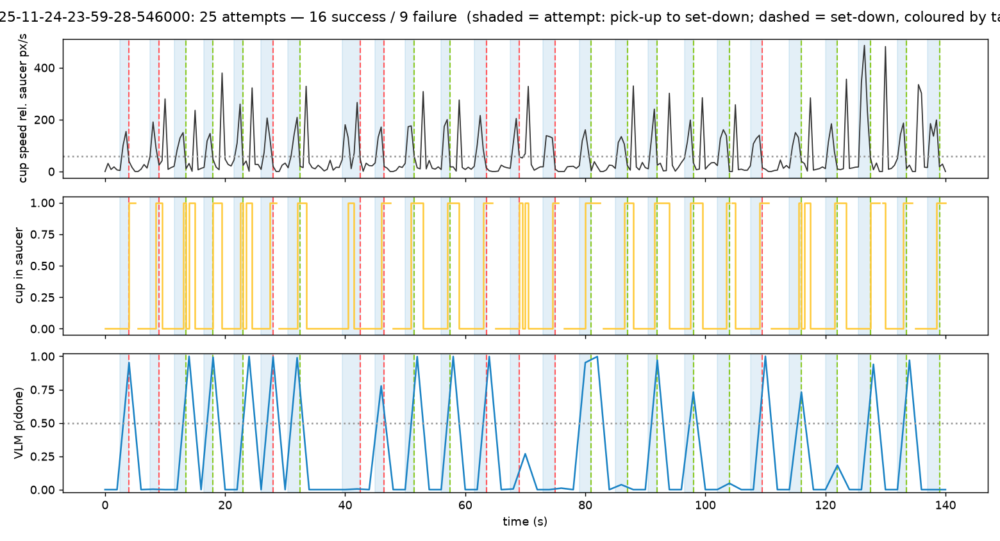

# Human Reward Model — Track 3

## The result: a failure audit of 50 human cup-on-saucer demos

> One-slide version: [`SLIDE.pptx`](SLIDE.pptx) · [`SLIDE.png`](SLIDE.png) · [`SLIDE.html`](SLIDE.html) · [`SLIDE.md`](SLIDE.md)

**Success = the cup ends up on the saucer; failure = it does not.** No labels exist for these
50 clips ([somundane/egoverse-cup50](https://huggingface.co/datasets/somundane/egoverse-cup50)),
so this is the Track 3 prevalence audit proper: four independent signals, every one run on
every clip, fused into one verdict per episode.

| signal | how | tagged success | failure prevalence |
|---|---|---|---|
| **SAM 3** geometry | text-prompted masks for `cup`, `saucer`; is the cup centroid inside the saucer box at the end? | 36/50 | 28% |
| **Qwen3-VL-8B** | p("Yes") from logits to *"is the cup resting on the saucer?"*, last quarter of frames, 3 fps | 33/50 | 34% |
| **PaliGemma2-3B** | same question, VQA-style prompt | 41/50 | 18% |
| **Cosmos-Reason2-8B** | same question, embodied-reasoning fine-tune of Qwen3-VL | 37/50 | 26% |
| **Fused** = mean(SEG, mean of VLMs) ≥ 0.5 | geometry and language weighted equally | **34/50** | **32%** |

**Agreement:** 26/50 clips unanimous across all four signals, 37/50 with ≥3 of 4, 6 split 2–2.
Per-episode votes: [`results/cup50_final.md`](results/cup50_final.md). Two independent kinds of
evidence — geometry and language — land on the same prevalence (28% vs 32%).

**Robustness to sampling rate:** the same audit at 1 fps (7 frames/clip from the HF parquet
instead of 20 from the 30 fps source) gives 35/15, 30% — **1 verdict out of 50 differs**, 27/50
unanimous. Individual models move more (Qwen 39→33 tagged success, Cosmos 34→37); the fusion
absorbs it. [`results/cup50_1fps_final.md`](results/cup50_1fps_final.md).

<table><tr>
<td> SAM 3 at 10 fps: <code>hand</code>, <code>cup</code>, <code>saucer</code> from text prompts — a unanimous success (4/4)</td>
<td> The confidence meter: p(cup on saucer) per frame from Qwen3-VL logits, same clip</td>
</tr></table>

<table><tr>
<td> ✅ unanimous success — SEG 1.00 · VLMs 0.96/0.79/1.00</td>
<td> ❌ unanimous failure — SEG 0.00 · VLMs 0.00/0.07/0.00</td>
<td> disputed — SEG 1.00, VLMs 0.32/0.58/0.00 → ✅ geometry carried it</td>
<td> disputed — SEG 0.00, VLMs 0.73/0.74/0.56 → ❌ geometry pulled the mean under 0.5</td>
</tr></table>

<table><tr>
<td> Tags per dataset × model at a fixed 0.5</td>
<td> Pairwise tag agreement on cup50</td>
</tr></table>

Every trace carries `source_indices` (sampled position → original frame), the model's top-5 first
tokens on the last frame (so you can see it is answering Yes/No and not something else), and the
overlay / meter videos are rendered in-container and written to both a local `<model>_out/` folder
and the `egoverse-outputs` Modal Volume. More clips, meters and stills: [`demo/`](demo/README.md).

## Side experiments

### Validation on a labelled robot slice
20 `eva_bimanual` cup-on-saucer episodes, 10 success / 10 failure — the only labels we had, used to
check the signals are real before running them on human video.

| signal | accuracy | AUROC |
|---|---|---|
| VLM p(done), last quarter (Qwen3-VL-8B) | 0.70 | **0.83** |
| SAM 3 cup-centroid-in-saucer | 0.70 | 0.64 |
| Fused + geometric veto | 0.70 | 0.74 |

<table><tr>
<td></td>
<td> A labelled failure: the meter never rises</td>
</tr></table>

Robot episodes also carry gripper proprioception, so a third signal exists there: `obs_gripper` vs
`cmd_gripper` gives holds, releases and slips directly (`geometric/`). Finding: **zero gripper slips
across all 10 failures** — on this task failures are hesitation, not drops.

### One 2-minute egocentric video, split into attempts
An aria head-cam episode is not one demo — the person places the cup 25 times. Segmenting on cup
rests *relative to the saucer* (so head motion cancels) and scoring each pick-up→set-down:
**25 attempts → 16 success / 9 failure**, plus 16 returns to the start position, correctly not counted.

<table><tr>
<td> SAM 3 tracking both hands, cup and saucer on the head-cam</td>
<td> cup speed rel. saucer · cup-in-saucer · VLM p(done), attempts shaded</td>
</tr></table>

Table: [`results/aria_split_2025-11-24-23-59-28-546000.md`](results/aria_split_2025-11-24-23-59-28-546000.md).

### Three things we learned (and can prove)

1. **Ask about the goal *state*, not "was the task completed?"** The latter is unanswerable from
   one frame; p(yes) sat at 10⁻⁴ on every frame while the *ranking* still worked (AUROC 0.73 →
   0.83 after the fix). And the smaller the model, the more literal the question: PaliGemma
   hedged at 0.28–0.65 on the generic prompt and became decisive (0.07–0.97) on "is the cup
   resting on the saucer?". Only visible because we read logits — 0.49 and 0.02 both print "No".
2. **Robot failures here are not drops.** Zero gripper slips across all 10 failures; hesitation
   (off-hand speed, dominant-arm path length) separates the classes. Geometry flags, VLM adjudicates.
3. **The unit of evaluation must match the video.** A cup50 clip is one attempt — score its end.
   An aria episode is 25 attempts — segment first, then score each. Camera motion has to cancel to
   segment: cup speed relative to a static scene object, not in image space.

**Cost:** geometric track is CPU, seconds. VLM at 1 fps is one batched forward pass per frame
(16/pass, H100); all 50 clips × 3 models ran in minutes. A full-dataset sweep is a `.map()`.

Full report with every graph and per-episode verdict: [`results/`](results/README.md).

