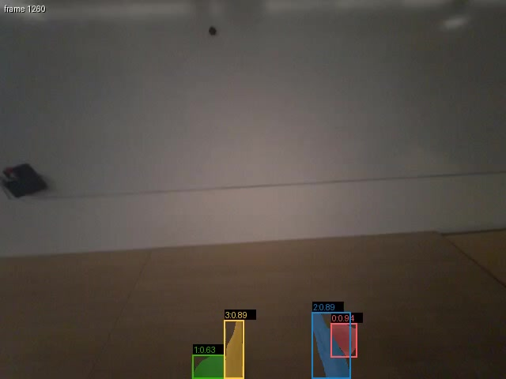
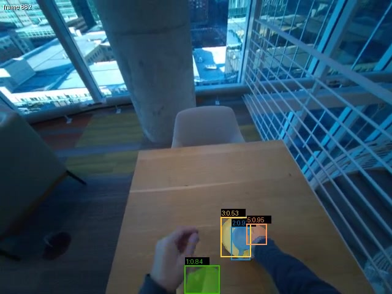
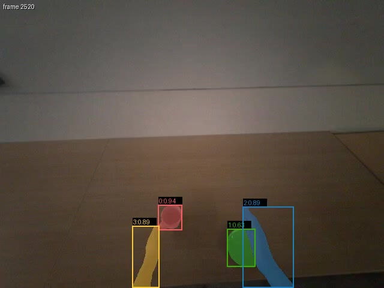
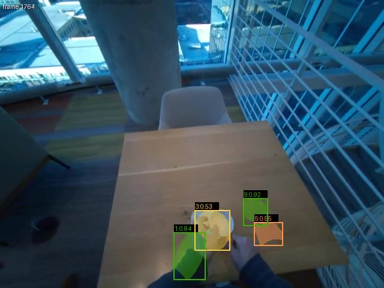
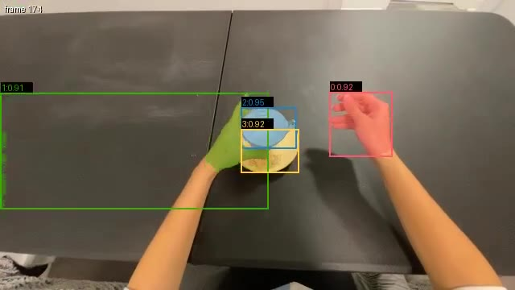
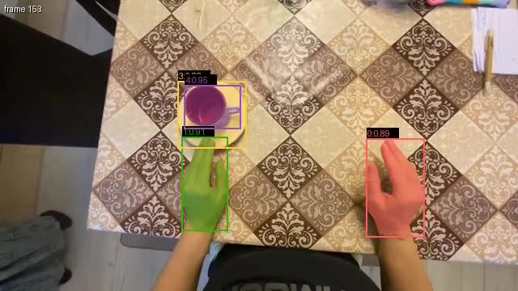
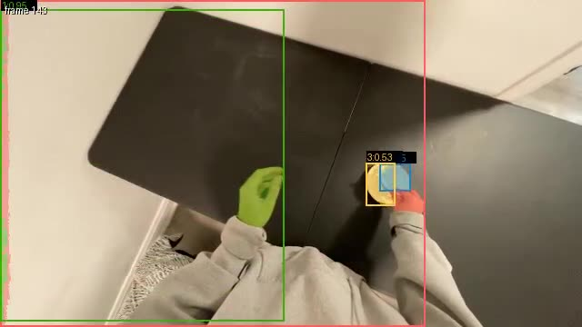
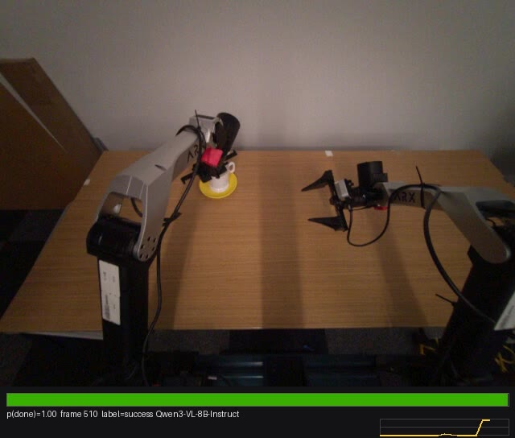
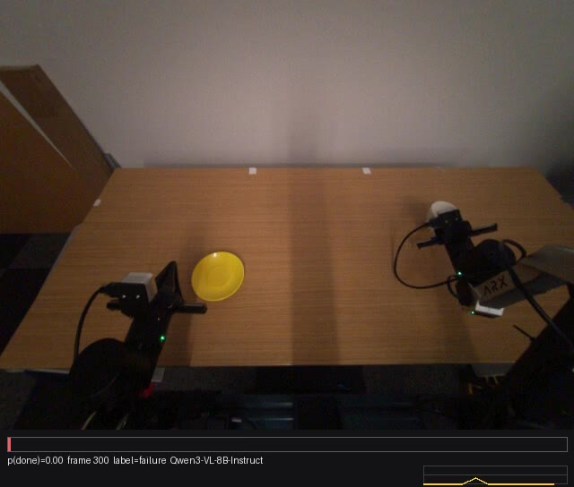
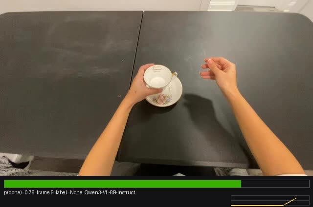

# Demo assets

Everything here was produced by the apps in `multi-model-modal/` on Modal today. Videos are
H.264 mp4; stills are frames pulled from those videos. GitHub renders the images inline; click
a video to download/play it.

## SAM 3 on egocentric human video — hands, cup, saucer from text prompts

`sam3/episodes.py --prompts "hand,cup,saucer" --stride 15` on 2-minute aria head-cam
episodes. Sampled at 2 fps, played back at 30 fps with held masks; each object keeps its colour
for its whole track. No per-episode seeding — the prompts are the nouns.

| `sam3_aria/2025-11-24-23-59-28-546000_overlay.mp4` | `sam3_aria/2025-11-27-23-12-34-299000_overlay.mp4` |
|---|---|
|  |  |
|  |  |

The first episode is the one split into 25 attempts in
[`results/aria_split_2025-11-24-23-59-28-546000.md`](../results/aria_split_2025-11-24-23-59-28-546000.md).

## SAM 3 on cup50 human clips at 10 fps

`sam3_10fps/` — five short clips, `--stride 3` on the 30 fps source (`hand, robot gripper, cup, saucer`).

|  |  |  |
|---|---|---|

## The verdicts, on video — cup50 final determination

From [`results/cup50_final.md`](../results/cup50_final.md): SAM 3 + three VLMs at 3 fps, `final = mean(SEG, mean(VLMs))`.

| clip | SEG | Cosmos | PaliGemma | Qwen | final | still (end of clip) |
|---|---|---|---|---|---|---|
| `unanimous_success_692e9892…` | 1.00 | 0.87 | 0.81 | 0.96 | ✅ 4/4 |  |
| `unanimous_failure_2026-01-11-23-11…` | 0.00 | 0.00 | 0.07 | 0.00 | ❌ 0/4 |  |
| `disputed_seg_yes_vlm_split_692ea3be…` | 1.00 | 0.74 | 0.46 | 0.63 | ✅ 3/4 — was 2/4 at 1 fps; at 3 fps Cosmos and Qwen joined the geometry |  |
| `disputed_seg_no_vlm_yes_692ea671…` | 0.00 | 0.32 | 0.86 | 0.04 | ❌ 1/4 — was 3 VLM yes-votes at 1 fps; at 3 fps Qwen and Cosmos joined SEG |  |

The two `disputed_*` clips were 2–2 and 3–1 splits at 1 fps; at 3 fps both resolved toward the geometry.
They are still the ones to scrub through — they show what each signal is looking at when the
language models are uncertain, and why sampling density matters for the VLMs and not for SEG.

## VLM confidence meters — deliverable #2 as a video

`vlm_meters/` — each frame with its p(cup on saucer) bar (green ≥ 0.5, red below), the trace-so-far
sparkline, source frame and label. Rendered in-container by `vlm_critic/app.py`.

| eva success (Qwen3-VL) | eva failure (Qwen3-VL) |
|---|---|
|  |  |

| cup50, Qwen3-VL | cup50, Cosmos-Reason2 |
|---|---|
|  |  |

`vlm_examples/` — two full-episode meter stills (eva success / failure).

## Robot slice overlays

`sam3_eva/` — two eva bimanual episodes (`cup, saucer`, 6 fps): one labelled success, one failure.

## Result summaries

- [`eva_fusion_summary.md`](eva_fusion_summary.md) — labelled 10/10 slice, per-criterion accuracy/AUROC
- [`cup50_prevalence_summary.md`](cup50_prevalence_summary.md) — SEG-only audit on 50 clips
- Full cross-model report with graphs: [`../results/`](../results/README.md)
