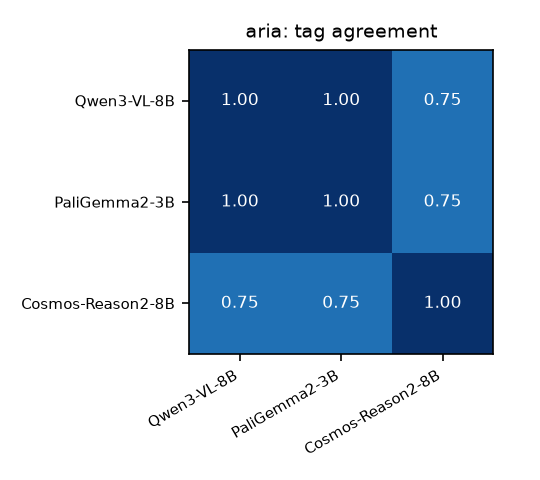
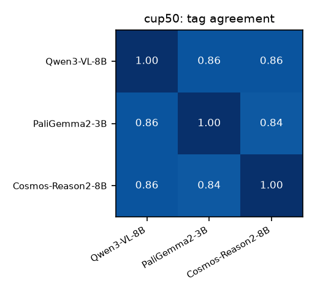
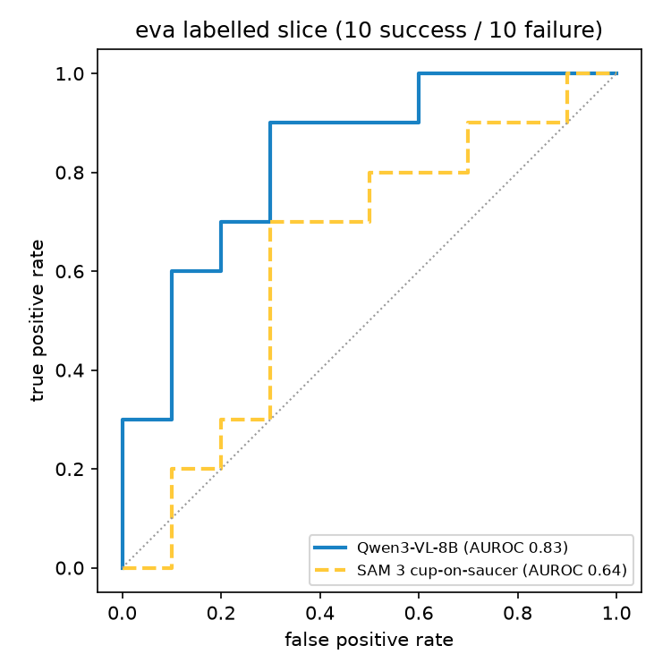
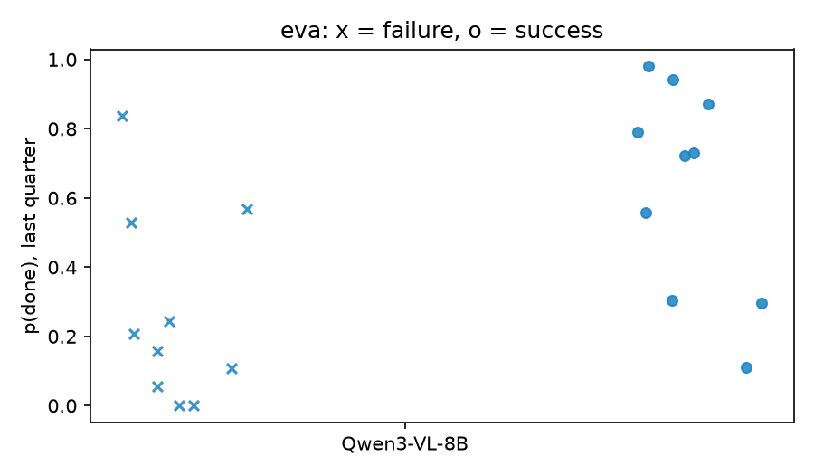
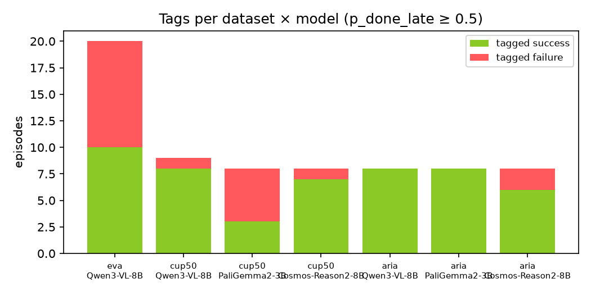
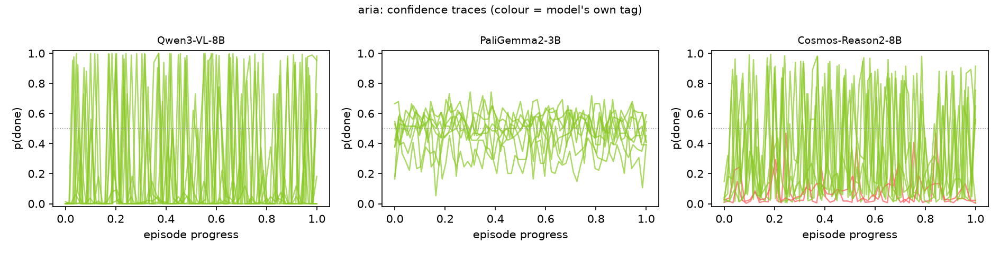
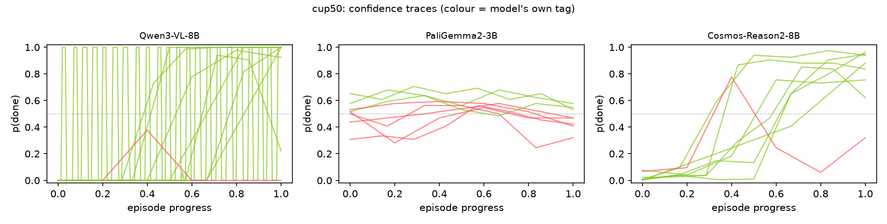
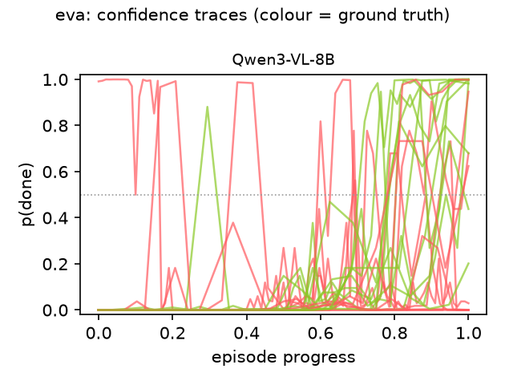

# Results

Generated by `fuse/report.py` from the traces on disk.

## Per-model summary

| dataset | model | n | tag stat | tagged success | tagged failure | failure prevalence | success @late | success @max | accuracy | AUROC |
|---|---|---|---|---|---|---|---|---|---|---|
| eva | Qwen3-VL-8B | 20 | late | 10 | 10 | 50% | 10/20 | 17/20 | 0.70 | 0.83 |
| cup50 | Qwen3-VL-8B | 9 | late | 8 | 1 | 11% | 8/9 | 8/9 | — | — |
| cup50 | PaliGemma2-3B | 8 | late | 3 | 5 | 62% | 3/8 | 8/8 | — | — |
| cup50 | Cosmos-Reason2-8B | 8 | late | 7 | 1 | 12% | 7/8 | 8/8 | — | — |
| aria | Qwen3-VL-8B | 8 | max | 8 | 0 | 0% | 0/8 | 8/8 | — | — |
| aria | PaliGemma2-3B | 8 | max | 8 | 0 | 0% | 4/8 | 8/8 | — | — |
| aria | Cosmos-Reason2-8B | 8 | max | 6 | 2 | 25% | 0/8 | 6/8 | — | — |

Accuracy/AUROC only where ground truth exists (eva); AUROC is threshold-free. Tag = stat ≥ 0.5. `late` = mean p(done) over the last quarter of frames; `max` = peak p(done). **aria uses `max`**: those are 80–140 s egocentric episodes and the person looks away after placing the cup, so the goal state is not in view at the end — `late` reads No for everything (0/8 under Qwen and Cosmos). Both counts are shown for every set so the choice is visible, not hidden.

**SEG-only (eva, 20 episodes):** cup-on-saucer ≥ 0.5 → 10 success / 10 failure (50% failure prevalence).

**SEG-only (cup50, 50 episodes):** cup-on-saucer ≥ 0.5 → 36 success / 14 failure (28% failure prevalence).

**SEG-only (aria, 5 episodes):** cup-on-saucer ≥ 0.5 → 2 success / 3 failure (60% failure prevalence).

## Per-episode verdicts

### eva — 20 eva_bimanual robot episodes, labelled 10/10

| episode | label | Qwen3-VL-8B (late) | SEG | consensus |
|---|---|---|---|---|
| 2026-03-01-21-39-55-154000 | failure | ❌ 0.06 (late 0.06 / max 1.00) | ✅ 1.00 | split (1/2) |
| 2026-03-01-21-53-09-065000 | failure | ❌ 0.00 (late 0.00 / max 0.00) | ❌ 0.00 | failure (0/2) |
| 2026-03-02-15-45-51-437000 | failure | ❌ 0.24 (late 0.24 / max 0.68) | ❌ 0.22 | failure (0/2) |
| 2026-03-02-15-46-41-397000 | failure | ❌ 0.16 (late 0.16 / max 0.78) | ❌ 0.06 | failure (0/2) |
| 2026-03-02-16-08-11-055000 | success | ✅ 0.94 (late 0.94 / max 1.00) | ❌ 0.05 | split (1/2) |
| 2026-03-03-23-34-24-249000 | failure | ✅ 0.53 (late 0.53 / max 1.00) | ❌ 0.42 | split (1/2) |
| 2026-03-03-23-40-31-935000 | success | ✅ 0.87 (late 0.87 / max 1.00) | ✅ 0.60 | success (2/2) |
| 2026-03-03-23-41-02-407000 | success | ✅ 0.72 (late 0.72 / max 1.00) | ❌ 0.25 | split (1/2) |
| 2026-03-04-19-11-58-058000 | success | ❌ 0.31 (late 0.31 / max 0.99) | ❌ 0.06 | failure (0/2) |
| 2026-03-04-19-14-13-994000 | success | ✅ 0.56 (late 0.56 / max 1.00) | ✅ 0.90 | success (2/2) |
| 2026-03-04-19-45-48-423000 | failure | ❌ 0.00 (late 0.00 / max 0.38) | ❌ 0.06 | failure (0/2) |
| 2026-03-04-19-47-54-081000 | success | ✅ 0.73 (late 0.73 / max 0.82) | ✅ 0.82 | success (2/2) |
| 2026-03-04-20-25-12-236000 | failure | ❌ 0.21 (late 0.21 / max 0.95) | ❌ 0.15 | failure (0/2) |
| 2026-03-04-20-35-14-105000 | success | ✅ 0.98 (late 0.98 / max 1.00) | ✅ 1.00 | success (2/2) |
| 2026-03-04-21-20-46-356000 | failure | ❌ 0.11 (late 0.11 / max 0.99) | ❌ 0.36 | failure (0/2) |
| 2026-03-04-21-54-13-056000 | success | ❌ 0.11 (late 0.11 / max 0.27) | ✅ 1.00 | split (1/2) |
| 2026-03-04-22-00-39-903000 | success | ❌ 0.30 (late 0.30 / max 0.73) | ✅ 0.68 | split (1/2) |
| 2026-03-04-22-36-13-297000 | failure | ✅ 0.57 (late 0.57 / max 0.73) | ✅ 1.00 | success (2/2) |
| 2026-03-04-23-11-19-672000 | failure | ✅ 0.84 (late 0.84 / max 1.00) | ✅ 0.96 | success (2/2) |
| 2026-03-04-23-18-15-776000 | success | ✅ 0.79 (late 0.79 / max 1.00) | ✅ 1.00 | success (2/2) |

### cup50 — human cup-on-saucer clips (somundane/egoverse-cup50), unlabelled

| episode | label | Qwen3-VL-8B (late) | PaliGemma2-3B (late) | Cosmos-Reason2-8B (late) | SEG | consensus |
|---|---|---|---|---|---|---|
| 2025-11-14-16-19-50-305000 | — | ✅ 0.53 (late 0.53 / max 1.00) | — | — | ✅ 0.50 | success (2/2) |
| 692e98927641010d04354574 | — | ✅ 1.00 (late 1.00 / max 1.00) | ✅ 0.58 (late 0.58 / max 0.68) | ✅ 0.96 (late 0.96 / max 0.96) | ✅ 1.00 | success (4/4) |
| 692e9b6668228e362d908f0e | — | ✅ 1.00 (late 1.00 / max 1.00) | ❌ 0.32 (late 0.32 / max 0.56) | ✅ 0.94 (late 0.94 / max 0.97) | ✅ 1.00 | success (3/4) |
| 692e9fa092a31767e35da22c | — | ✅ 0.92 (late 0.92 / max 0.98) | ❌ 0.41 (late 0.41 / max 0.59) | ✅ 0.75 (late 0.75 / max 0.75) | ✅ 1.00 | success (3/4) |
| 692ea164e2322e3b092b5dd8 | — | ✅ 1.00 (late 1.00 / max 1.00) | ❌ 0.47 (late 0.47 / max 0.58) | ✅ 0.88 (late 0.88 / max 0.88) | ✅ 1.00 | success (3/4) |
| 692ea2012c8fefa9948e8dd0 | — | ✅ 1.00 (late 1.00 / max 1.00) | ✅ 0.55 (late 0.55 / max 0.68) | ✅ 0.95 (late 0.95 / max 0.95) | ✅ 1.00 | success (4/4) |
| 692ea3beffdc0ca6345c4246 | — | ❌ 0.00 (late 0.00 / max 0.38) | ❌ 0.47 (late 0.47 / max 0.55) | ❌ 0.32 (late 0.32 / max 0.78) | ✅ 1.00 | failure (1/4) |
| 692ea4da74b24813e759755d | — | ✅ 1.00 (late 1.00 / max 1.00) | ✅ 0.59 (late 0.59 / max 0.71) | ✅ 0.86 (late 0.86 / max 0.90) | ✅ 1.00 | success (4/4) |
| 692ea671dbc4294a49cc727e | — | ✅ 0.56 (late 0.56 / max 0.94) | ❌ 0.44 (late 0.44 / max 0.56) | ✅ 0.73 (late 0.73 / max 0.85) | ❌ 0.00 | split (2/4) |

### aria — human egocentric cup-on-saucer episodes (aria), unlabelled

| episode | label | Qwen3-VL-8B (max) | PaliGemma2-3B (max) | Cosmos-Reason2-8B (max) | SEG | consensus |
|---|---|---|---|---|---|---|
| 2025-11-24-23-59-28-546000 | — | ✅ 1.00 (late 0.22 / max 1.00) | ✅ 0.69 (late 0.52 / max 0.69) | ✅ 0.99 (late 0.25 / max 0.99) | ❌ 0.29 | success (3/4) |
| 2025-11-25-23-53-35-467000 | — | ✅ 0.88 (late 0.05 / max 0.88) | ✅ 0.61 (late 0.38 / max 0.61) | ❌ 0.47 (late 0.06 / max 0.47) | ❌ 0.14 | split (2/4) |
| 2025-11-27-23-12-34-299000 | — | ✅ 0.78 (late 0.11 / max 0.78) | ✅ 0.67 (late 0.52 / max 0.67) | ✅ 0.56 (late 0.17 / max 0.56) | ✅ 0.53 | success (4/4) |
| 2025-11-27-23-13-48-498000 | — | ✅ 0.56 (late 0.06 / max 0.56) | ✅ 0.65 (late 0.49 / max 0.65) | ❌ 0.29 (late 0.08 / max 0.29) | ✅ 0.55 | success (3/4) |
| 2025-11-27-23-15-59-065000 | — | ✅ 0.99 (late 0.06 / max 0.99) | ✅ 0.65 (late 0.47 / max 0.65) | ✅ 0.88 (late 0.36 / max 0.88) | ❌ 0.48 | success (3/4) |
| 2025-11-27-23-16-45-029000 | — | ✅ 1.00 (late 0.40 / max 1.00) | ✅ 0.69 (late 0.54 / max 0.69) | ✅ 0.99 (late 0.39 / max 0.99) | — | success (3/3) |
| 2025-11-27-23-18-17-895000 | — | ✅ 1.00 (late 0.33 / max 1.00) | ✅ 0.58 (late 0.32 / max 0.58) | ✅ 0.97 (late 0.38 / max 0.97) | — | success (3/3) |
| 2025-11-27-23-45-29-883000 | — | ✅ 1.00 (late 0.36 / max 1.00) | ✅ 0.74 (late 0.55 / max 0.74) | ✅ 0.96 (late 0.35 / max 0.96) | — | success (3/3) |

## What the model wanted to say (top-5 first tokens, last frame)

- **eva / Qwen3-VL-8B** (2026-03-01-21-39-55-154000): `No`=0.9707, `Yes`=0.0293, `no`=0.0, `yes`=0.0, `There`=0.0
- **cup50 / Qwen3-VL-8B** (2025-11-14-16-19-50-305000): `Yes`=0.9991, `yes`=0.0009, `No`=0.0, `YES`=0.0, ` Yes`=0.0
- **cup50 / PaliGemma2-3B** (692e98927641010d04354574): `yes`=0.5175, `no`=0.3786, `answer`=0.002, `achieved`=0.0017, `un`=0.0011
- **cup50 / Cosmos-Reason2-8B** (692e98927641010d04354574): `Yes`=0.9626, `No`=0.0373, ` Yes`=0.0, `yes`=0.0, `Y`=0.0
- **aria / Qwen3-VL-8B** (2025-11-24-23-59-28-546000): `No`=1.0, `Yes`=0.0, `no`=0.0, `NO`=0.0, `There`=0.0
- **aria / PaliGemma2-3B** (2025-11-24-23-59-28-546000): `no`=0.3464, `yes`=0.2381, `un`=0.2381, `achieved`=0.0111, `unknown`=0.0044
- **aria / Cosmos-Reason2-8B** (2025-11-24-23-59-28-546000): `No`=0.9963, `Yes`=0.0036, `no`=0.0, `NO`=0.0, ` No`=0.0

## Graphs

### agreement_aria

### agreement_cup50

### eva_roc

### eva_scores_by_label

### prevalence

### traces_aria

### traces_cup50

### traces_eva

